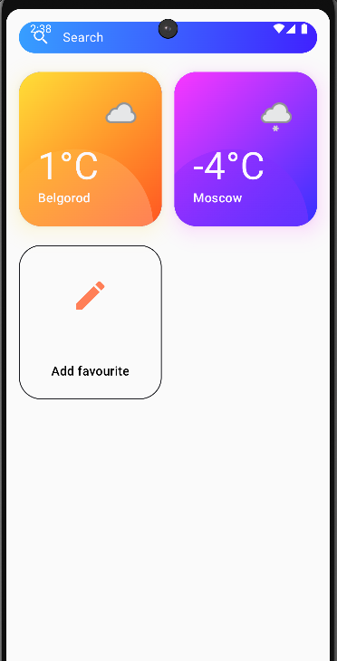
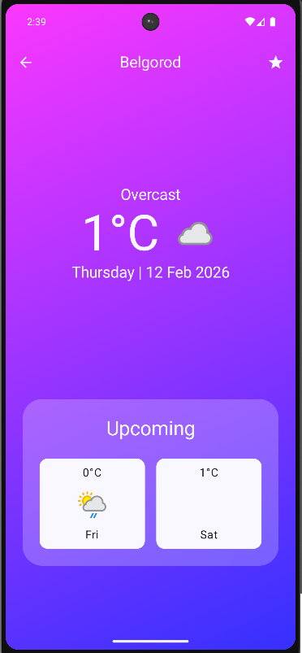
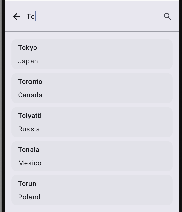
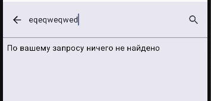
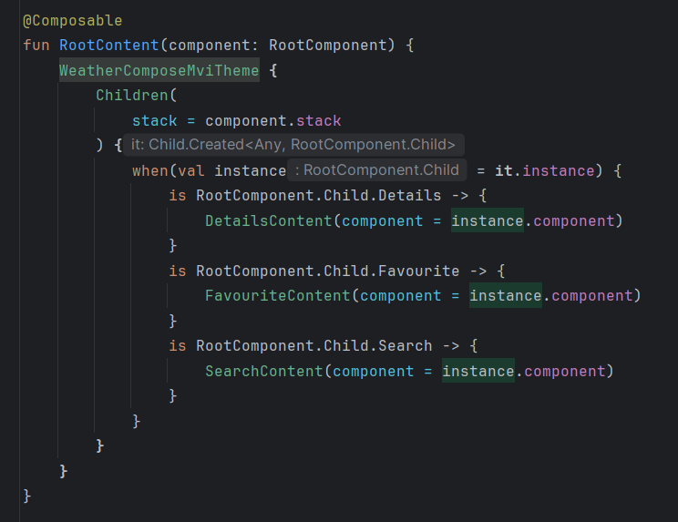

# 🌤 WeatherComposeMVI

**WeatherComposeMVI** — Android-приложение для просмотра погоды, написанное на **Kotlin** с использованием **Jetpack Compose** и **Clean Architecture**.  
Проект ориентирован на масштабируемость, читаемость кода и современные best practices Android-разработки.

---

## ✨ Основные возможности
- Просмотр текущей погоды и детальной информации о выбранном городе
- Поиск городов с обработкой ошибок
- Локальное кэширование данных (**Room**)
- Навигация между экранами через **Decompose stack navigation**
- Асинхронная работа с сетью через **Retrofit + Coroutine Flow**
- Загрузка изображений через **Glide**
- Чёткое разделение слоёв архитектуры для удобной поддержки и тестирования

---

## 🏗 Архитектура

Проект построен на **Clean Architecture** и разделён на три слоя:

### 📦 Data
- `local/` — локальное хранилище через **Room**
- `network/` — API через **Retrofit**, DTO
- `Mapper` — преобразование данных между слоями
- Реализация репозиториев

### ⚙️ Domain
- Сущности (**Entity**) и интерфейсы репозиториев
- **UseCases** для бизнес-логики
- Независимость от Android SDK

### 🎨 Presentation
- **MVI** архитектура с компонентами (`RootComponent` и дочерние)
- **Decompose stack navigation** (arkivanov/Decompose) для навигации между экранами
- **Jetpack Compose** UI

---

## 🔄 DI (Dependency Injection)

Для внедрения зависимостей используется **Dagger 2**:  
- `ApplicationComponent` с кастомным `@ApplicationScope`  
- Модули:
  - `DataModule`
  - `ViewModelModule`  

---

## 🛠 Используемые технологии

| Слой | Технологии |
|------|------------|
| Presentation | Jetpack Compose, MVI, Decompose (stack navigation), Glide |
| Domain | UseCases, Entity, Repository interfaces |
| Data | Room, Retrofit, DTO, Mapper, Coroutine Flow |
| DI | Dagger 2 (Modules, Component, Custom Scope) |

---

## 📸 Скриншоты

**Главный экран**  

**Детальная информация о погоде**  

**Экран поиска**  

**Ошибка при поиске**  

**Навигация между экранами**  

---

## 🚀 Запуск проекта
1. Склонировать репозиторий  
2. Открыть в Android Studio  
3. Запустить на эмуляторе или устройстве  

---

## 📌 Планы по улучшению
- Добавить **Unit-тесты**  
- Реализовать Compose-функции для экранов Initial и Error  
- Исправить баг с **Search**, чтобы поле имело отступ от верхней границы  
- Оптимизировать навигацию и анимации между экранами  

---

## 👤 Автор
Разработано с ❤️ на Kotlin
